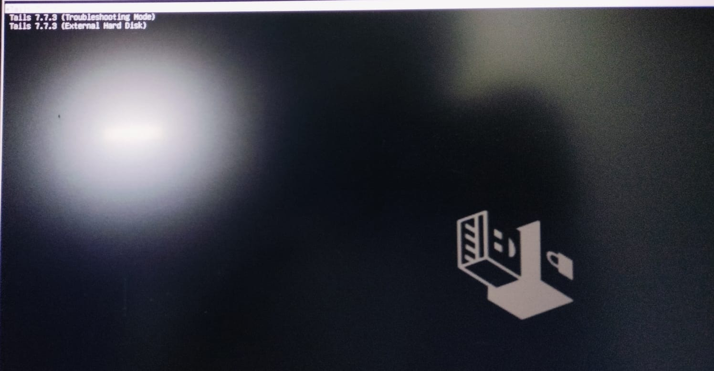
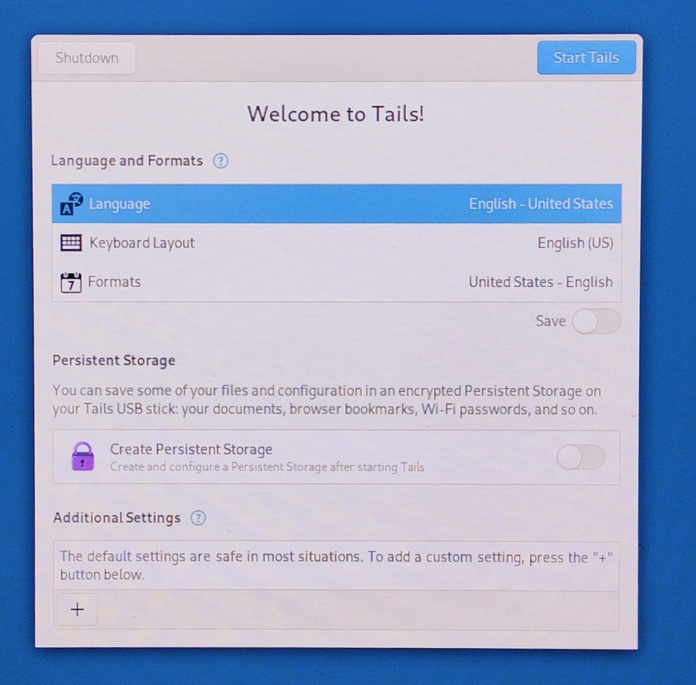
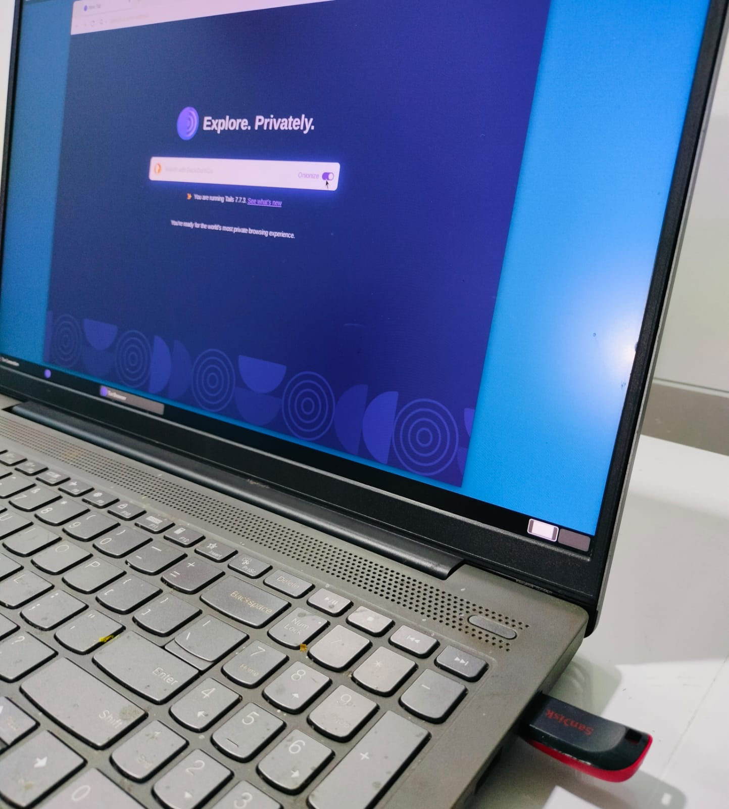

Tails is a linux based distro made with only two things in mind: Privacy and Anonymity

Special pros of tails:

- Amnesic: 
  The moment the computer is shut down or USB is unpluged, Tails completely vanishes. It Runs entirely on computer's RAM. When it shuts down,   it overwrites its entire RAM footprint with Zeros, leaving no digital footprints, cookies or hisory.

- Hides IP Address: 
  All internet traffic is forced through the tor network by default, Making it insanely hard to be tracked. If an application tries to bypass    tor, it is blocked. This hides the physical location and IP Address, making it significantly harder to associate activity with the user’s     real IP address.

- prevents DNS leaks: 
  on a normal operating system, even if one uses VPN or proxy, the computer asks the ISP to translate the web addresses like google.com         into IP addresses. DNS requests can reveal which domains are being looked up, even if the content of the traffic is encrypted. Tails          handles this by forcing all the DNS request through tor's built-in anonymous DNS resolver.

- protection against malware: 
  If a malware is downloaded accidentally, it is generally removed after shutdown because the system is amnesic. However, this does not         guarantee protection against every threat or exploit.

  

OPSEC Lessons

opsec is not a script or a checklist to follow. It is the mindset that assumes that the internet is tracing everything. It involves looking at your own system and operations with a exploiter's perspective.

stylometry(Behavioral Fingerprinting)

Even with the IP address hidden, a person can be tracked by comparing the vocabulary, typing style, common phrases used online with a public profile, liked LinkedIn with high accuracy.

Login

Even after using anonymity tools like tails, logging into profiles like that of Google or LinkedIn, etc, completely exposes the person.

common misconception

It is inherently illicit or criminal. 
Tor was originally designed by the U.S. Naval Research Laboratory for Anonymous government communications. Today, it is used around the world by journalists, human rights whistleblowers, and citizens bypassing censorship.

## Boot Menu

## Welcome Screen

## Tor Connection

  
 
